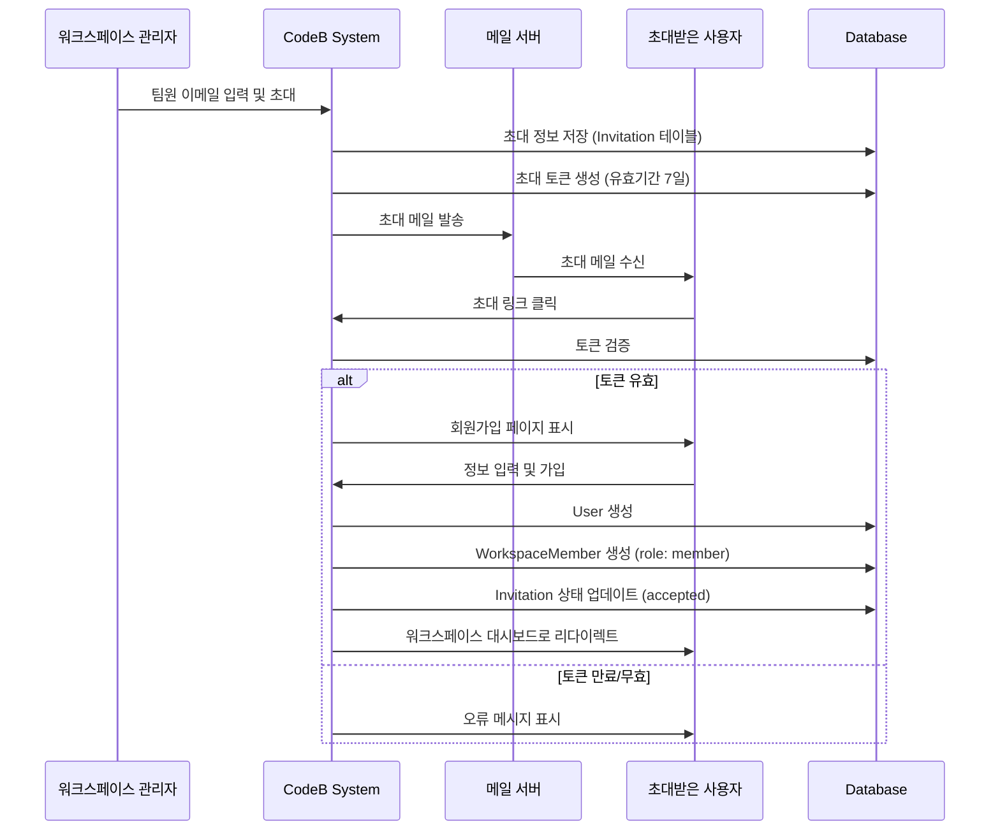
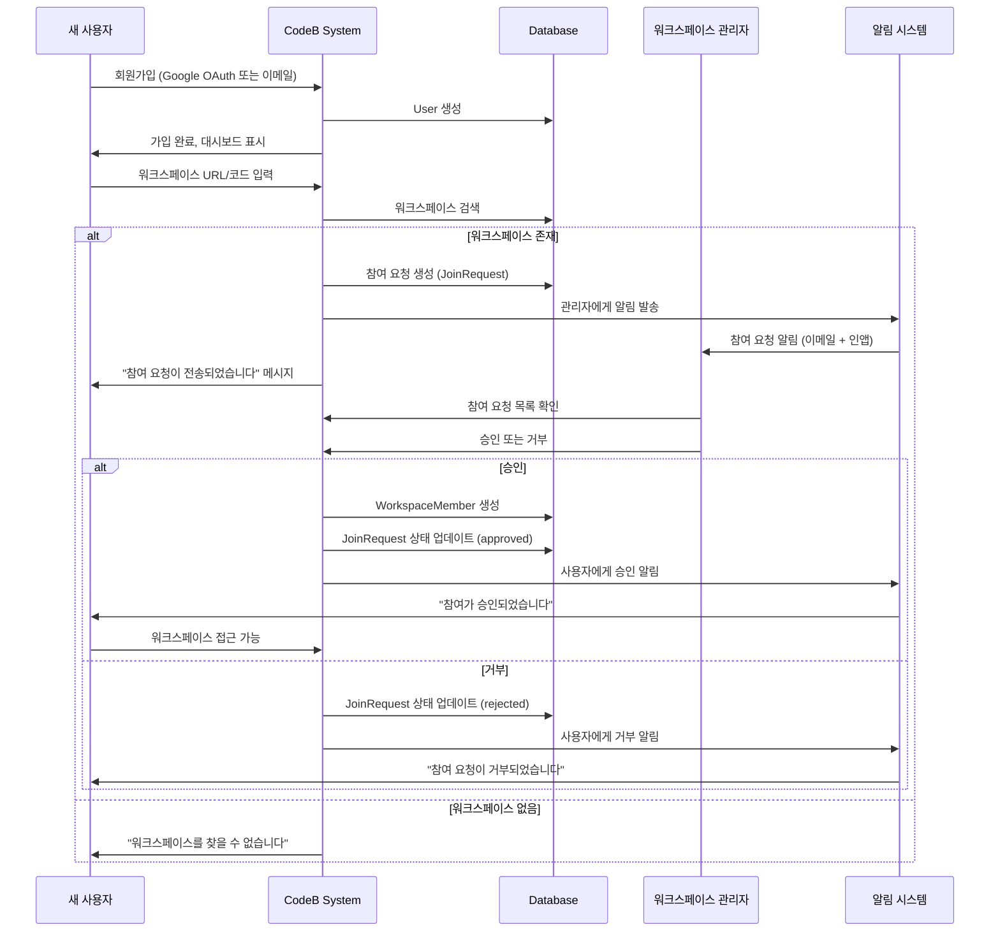
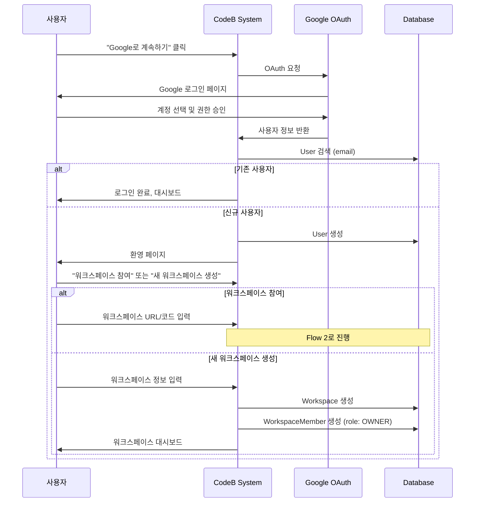

# CodeB Platform - 사용자 가입 및 워크스페이스 참여 플로우

## 개요

CodeB Platform은 두 가지 주요 사용자 가입 방식을 지원합니다:

1. **이메일 초대 방식** - 워크스페이스 관리자가 초대 메일 발송
2. **직접 가입 방식** - 사용자가 직접 회원가입 후 워크스페이스 참여 요청

---

## Flow 1: 이메일 초대 방식 (Invitation Flow)

### 사용 시나리오
- 기존 워크스페이스에 팀원을 초대
- 관리자가 사전에 승인된 사용자만 초대
- 프로젝트 시작 시 팀 구성원 일괄 초대

### 워크플로우



### 데이터 모델

```prisma
model Invitation {
  id            String   @id @default(cuid())
  workspaceId   String
  workspace     Workspace @relation(fields: [workspaceId], references: [id], onDelete: Cascade)

  email         String
  token         String   @unique
  role          Role     @default(MEMBER)

  invitedBy     String
  inviter       User     @relation("InvitedBy", fields: [invitedBy], references: [id])

  status        InvitationStatus @default(PENDING)
  expiresAt     DateTime
  acceptedAt    DateTime?

  createdAt     DateTime @default(now())
  updatedAt     DateTime @updatedAt

  @@index([email])
  @@index([token])
  @@index([workspaceId])
}

enum InvitationStatus {
  PENDING
  ACCEPTED
  EXPIRED
  REVOKED
}
```

### API 엔드포인트

#### 1. 초대 메일 발송
```typescript
POST /api/workspaces/[workspaceId]/invitations

Request:
{
  "emails": ["user1@example.com", "user2@example.com"],
  "role": "MEMBER", // ADMIN, MEMBER, VIEWER
  "message": "프로젝트에 참여해주세요!" // 선택사항
}

Response:
{
  "success": true,
  "invitations": [
    {
      "id": "inv_123",
      "email": "user1@example.com",
      "token": "abc123...",
      "expiresAt": "2025-12-01T00:00:00Z"
    }
  ]
}
```

#### 2. 초대 수락
```typescript
POST /api/invitations/accept

Request:
{
  "token": "abc123...",
  "userData": {
    "name": "홍길동",
    "password": "secure_password"
  }
}

Response:
{
  "success": true,
  "user": { ... },
  "workspace": { ... }
}
```

---

## Flow 2: 직접 가입 + 워크스페이스 참여 요청 (Join Request Flow)

### 사용 시나리오
- 사용자가 워크스페이스 URL/코드를 알고 있는 경우
- 공개 워크스페이스에 참여
- 이메일 초대 없이 자발적 참여

### 워크플로우



### 데이터 모델

```prisma
model JoinRequest {
  id            String   @id @default(cuid())
  workspaceId   String
  workspace     Workspace @relation(fields: [workspaceId], references: [id], onDelete: Cascade)

  userId        String
  user          User     @relation(fields: [userId], references: [id], onDelete: Cascade)

  message       String?  // 사용자가 작성한 참여 요청 메시지
  status        JoinRequestStatus @default(PENDING)

  reviewedBy    String?
  reviewer      User?    @relation("ReviewedBy", fields: [reviewedBy], references: [id])
  reviewedAt    DateTime?
  reviewNote    String?  // 관리자의 승인/거부 사유

  createdAt     DateTime @default(now())
  updatedAt     DateTime @updatedAt

  @@unique([workspaceId, userId])
  @@index([userId])
  @@index([workspaceId, status])
}

enum JoinRequestStatus {
  PENDING
  APPROVED
  REJECTED
  CANCELLED
}

model Workspace {
  id                String   @id @default(cuid())
  name              String
  slug              String   @unique  // URL friendly: codeb-team
  inviteCode        String   @unique  // 짧은 코드: ABC123
  isPublic          Boolean  @default(false) // 공개 워크스페이스 여부
  requireApproval   Boolean  @default(true)  // 참여 요청 승인 필요 여부

  // ... 기존 필드들
}
```

### API 엔드포인트

#### 1. 워크스페이스 검색
```typescript
GET /api/workspaces/search?q=[slug or inviteCode]

Response:
{
  "workspace": {
    "id": "ws_123",
    "name": "CodeB Team",
    "slug": "codeb-team",
    "isPublic": true,
    "requireApproval": true,
    "memberCount": 15
  }
}
```

#### 2. 참여 요청 제출
```typescript
POST /api/workspaces/[workspaceId]/join-requests

Request:
{
  "message": "안녕하세요! 프론트엔드 개발자입니다. 프로젝트에 참여하고 싶습니다."
}

Response:
{
  "success": true,
  "joinRequest": {
    "id": "jr_123",
    "status": "PENDING",
    "createdAt": "2025-11-24T00:00:00Z"
  }
}
```

#### 3. 참여 요청 목록 조회 (관리자용)
```typescript
GET /api/workspaces/[workspaceId]/join-requests?status=PENDING

Response:
{
  "joinRequests": [
    {
      "id": "jr_123",
      "user": {
        "id": "user_456",
        "name": "홍길동",
        "email": "hong@example.com",
        "avatar": "https://..."
      },
      "message": "참여하고 싶습니다",
      "createdAt": "2025-11-24T00:00:00Z"
    }
  ],
  "total": 3
}
```

#### 4. 참여 요청 승인/거부
```typescript
POST /api/workspaces/[workspaceId]/join-requests/[requestId]/review

Request:
{
  "action": "APPROVE", // or "REJECT"
  "role": "MEMBER",    // APPROVE 시 필수
  "note": "환영합니다!" // 선택사항
}

Response:
{
  "success": true,
  "status": "APPROVED"
}
```

---

## Flow 3: Google OAuth 직접 가입

### 워크플로우



---

## 통합 사용자 여정

### 시나리오 1: 초대받은 사용자
1. **이메일 수신**: "CodeB Team이 당신을 초대했습니다"
2. **링크 클릭**: 초대 수락 페이지로 이동
3. **가입 방법 선택**: Google 로그인 또는 이메일/비밀번호
4. **자동 참여**: 승인 없이 바로 워크스페이스 멤버로 등록
5. **온보딩**: 프로젝트 및 작업 소개

### 시나리오 2: 스스로 가입하는 사용자
1. **홈페이지 방문**: codeb.com
2. **회원가입**: Google 로그인 또는 이메일
3. **선택지 제시**:
   - "워크스페이스 참여하기" → URL/코드 입력
   - "새 워크스페이스 만들기"
4. **참여 요청** (기존 워크스페이스 참여 선택 시):
   - 워크스페이스 검색
   - 참여 메시지 작성
   - 요청 전송
5. **승인 대기**: "관리자 승인 대기 중" 상태
6. **승인 알림**: 이메일 + 인앱 알림
7. **워크스페이스 접근**: 승인 후 자동 접근 가능

---

## UI/UX 가이드

### 1. 초대 메일 템플릿

**제목**: [워크스페이스명]에서 당신을 초대했습니다

**본문**:
```html
안녕하세요!

[관리자명]님이 CodeB Platform의 [워크스페이스명]에 당신을 초대했습니다.

워크스페이스: [워크스페이스명]
역할: [Member/Admin]
초대 메시지: [관리자가 작성한 메시지]

아래 버튼을 클릭하여 초대를 수락하세요:

[초대 수락하기 버튼]

이 초대 링크는 7일 후에 만료됩니다.

초대를 받은 적이 없다면 이 메일을 무시하셔도 됩니다.

감사합니다,
CodeB Platform Team
```

### 2. 워크스페이스 참여 페이지

```
┌─────────────────────────────────────┐
│   워크스페이스에 참여하세요          │
├─────────────────────────────────────┤
│                                     │
│  워크스페이스 URL 또는 초대 코드:    │
│  ┌──────────────────────────────┐  │
│  │ codeb-team 또는 ABC123        │  │
│  └──────────────────────────────┘  │
│                                     │
│  ┌──────────────────────────────┐  │
│  │        검색하기               │  │
│  └──────────────────────────────┘  │
│                                     │
│  또는                                │
│                                     │
│  ┌──────────────────────────────┐  │
│  │  새 워크스페이스 만들기        │  │
│  └──────────────────────────────┘  │
└─────────────────────────────────────┘
```

### 3. 참여 요청 작성 페이지

```
┌─────────────────────────────────────┐
│   CodeB Team에 참여 요청             │
├─────────────────────────────────────┤
│                                     │
│  워크스페이스 정보:                   │
│  • 이름: CodeB Team                  │
│  • 멤버: 15명                        │
│  • 공개 워크스페이스                  │
│                                     │
│  참여 요청 메시지 (선택):             │
│  ┌──────────────────────────────┐  │
│  │ 안녕하세요!                    │  │
│  │ 프론트엔드 개발자입니다.       │  │
│  │ React 5년 경력이 있습니다.     │  │
│  │                               │  │
│  └──────────────────────────────┘  │
│                                     │
│  ┌──────────────────────────────┐  │
│  │        참여 요청 보내기         │  │
│  └──────────────────────────────┘  │
└─────────────────────────────────────┘
```

### 4. 참여 요청 관리 페이지 (관리자용)

```
┌─────────────────────────────────────────────┐
│   참여 요청 (3)                              │
├─────────────────────────────────────────────┤
│                                             │
│  ┌──────────────────────────────────────┐  │
│  │ 홍길동                                │  │
│  │ hong@example.com                     │  │
│  │ "안녕하세요! 참여하고 싶습니다."      │  │
│  │ 2시간 전                              │  │
│  │                                       │  │
│  │  [승인]  [거부]  [프로필 보기]        │  │
│  └──────────────────────────────────────┘  │
│                                             │
│  ┌──────────────────────────────────────┐  │
│  │ 김철수                                │  │
│  │ kim@example.com                      │  │
│  │ "프로젝트 관리 경험이 있습니다"       │  │
│  │ 1일 전                                │  │
│  │                                       │  │
│  │  [승인]  [거부]  [프로필 보기]        │  │
│  └──────────────────────────────────────┘  │
└─────────────────────────────────────────────┘
```

---

## 보안 고려사항

### 1. 초대 토큰
- 암호화된 랜덤 토큰 (최소 32자)
- 7일 유효기간
- 일회용 (한 번 사용 후 무효화)
- HTTPS only

### 2. 참여 요청
- Rate limiting (사용자당 하루 5개 요청)
- 스팸 방지 (같은 워크스페이스에 중복 요청 불가)
- 관리자 권한 검증
- 감사 로그 기록

### 3. 워크스페이스 접근
- 초대 코드 정기 변경 옵션
- IP 화이트리스트 (선택사항)
- 2FA 강제 (관리자 설정)

---

## 알림 전략

### 초대 메일 발송 시
- ✅ 초대받은 사용자: 이메일
- ✅ 초대한 관리자: 인앱 알림 (발송 확인)

### 참여 요청 제출 시
- ✅ 요청한 사용자: 인앱 알림 (제출 확인)
- ✅ 워크스페이스 관리자: 이메일 + 인앱 알림

### 참여 요청 승인/거부 시
- ✅ 요청한 사용자: 이메일 + 인앱 알림
- ✅ 승인한 관리자: 인앱 알림 (완료 확인)

---

## 구현 우선순위

### Phase 1: 기본 초대 기능 (필수)
1. Invitation 모델 및 API
2. 초대 메일 발송
3. 초대 수락 페이지
4. 기본 이메일 템플릿

### Phase 2: 직접 가입 기능
1. JoinRequest 모델 및 API
2. 워크스페이스 검색
3. 참여 요청 제출
4. 관리자 승인 UI

### Phase 3: Google OAuth 통합
1. NextAuth.js 설정
2. Google Provider 추가
3. 자동 사용자 생성
4. 온보딩 플로우

### Phase 4: 고급 기능
1. 일괄 초대 (CSV 업로드)
2. 초대 링크 재발송
3. 참여 요청 자동 승인 규칙
4. 참여 요청 필터링 및 검색

---

**작성일**: 2025-11-24
**버전**: 1.0.0
**작성자**: CodeB Development Team
